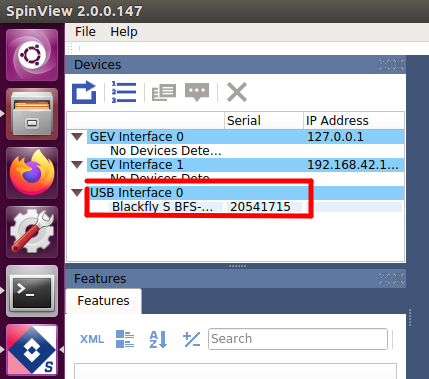

# spinview를 활용한 usb 카메라 사용

## spinview

1. 터미널 창 에서 spinview sdk를 실행

   ```
   spinview
   ```

2. usb 카메라와 pc 연결

   

3. spinview 화면에서 usb interface 의 device 이름이 뜨는지 확인 후 serial 번호 확인 

   

   

4. ros package에서 카메라 serial 변경

   spinnaker_sdk_camera_driver  package 내의 params/test_params.yaml 을 열어줍니다.

   ```
   $ roscd spinnaker_sdk_camera_dirver
   spinnaker_sdk_camera_dirver $  gedit params/test_params.yaml
   ```

   test_params.yaml에서 cam_ids와 master_cam의 숫자를 4.에서 확인한 serial로 변경 및 image_height, image_width도 사양에 맞게 변경 확인

   ```
   cam_ids:
   - 20541715 (변경)
   cam_aliases:
   - cam0
   master_cam: 20541715 (변경)
   skip: 20
   delay: 1.0
   
   distortion_model: plumb_bob
   image_height: 1200 (변경)
   image_width: 1920  (변경)
   ```

   

6.  image의 rostopic 이름 변경 확인

   topic 이름 설정 코드 경로

   ```
   $ roscd spinnaker_sdk_camera_dirver
   spinnaker_sdk_camera_dirver $  gedit src/capture.cpp
   ```

   해당 cpp 파일에서 225 번째줄인

   ```c++
   camera_image_pubs.push_back(it_->advertiseCamera("camera_array/"+cam_names_[j]+"/image_raw", 1));
   ```

   에서 

   ```c++
   camera_image_pubs.push_back(it_->advertiseCamera("camera_array/image_color", 1));
   ```

   로 변경 되있는지 확인


8. roslanch 실행  node_acquisition.launch 파일 실행, 실행시 color는 true로 실행

   ```
   $ roslanch spinnaker_sdk_camera_dirver node_acquisition.launch color:=true
   ```

   

## 해당 pack 실행 순서

카메라 topic 받아오는 노드와 조도 조절 노드 실행

```
$ rosrun camera_parameter camera_teset.py
$ rosrun camera_parameter spin_config.py
```

